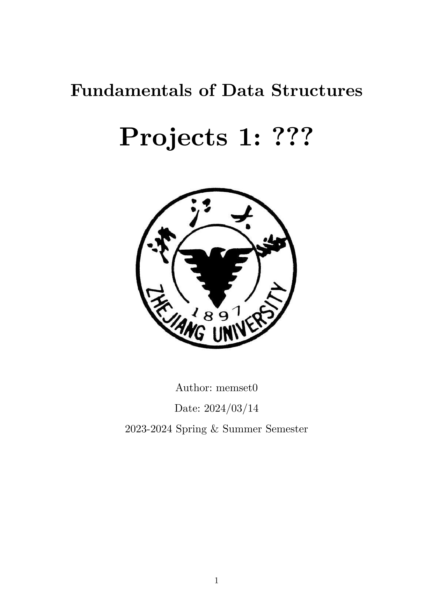
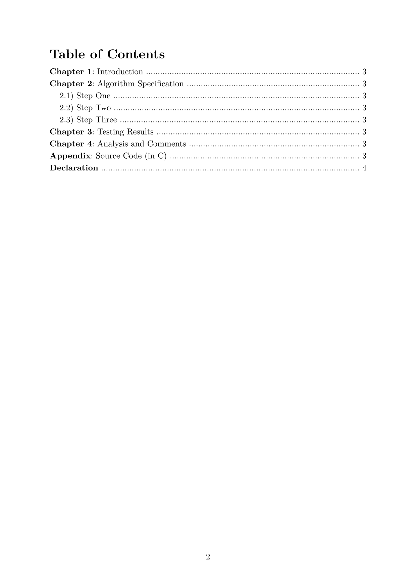
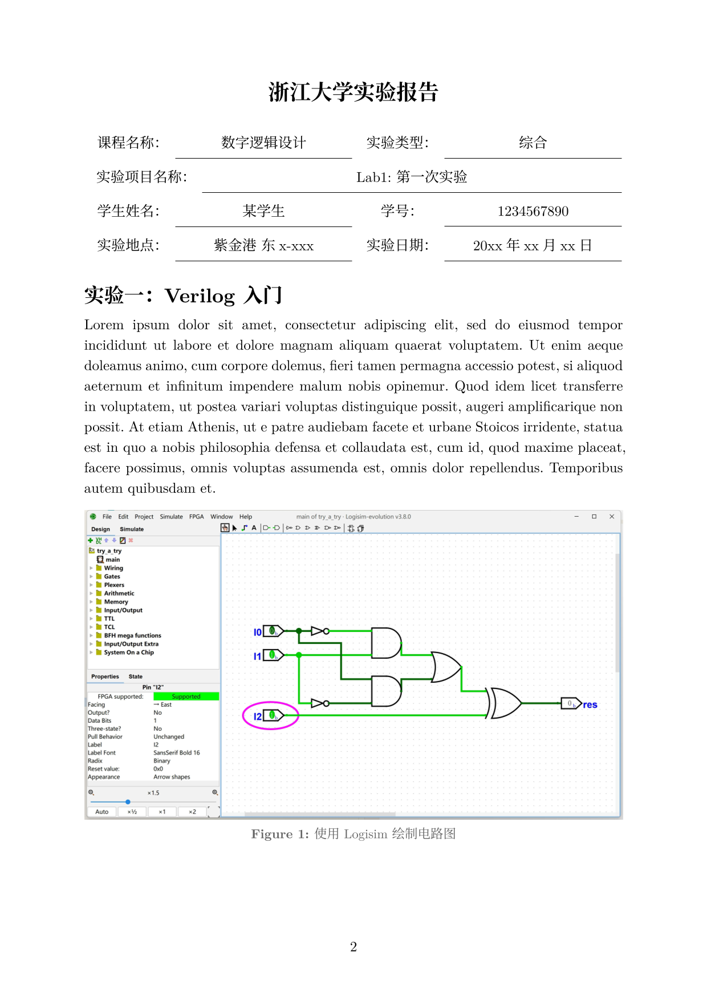
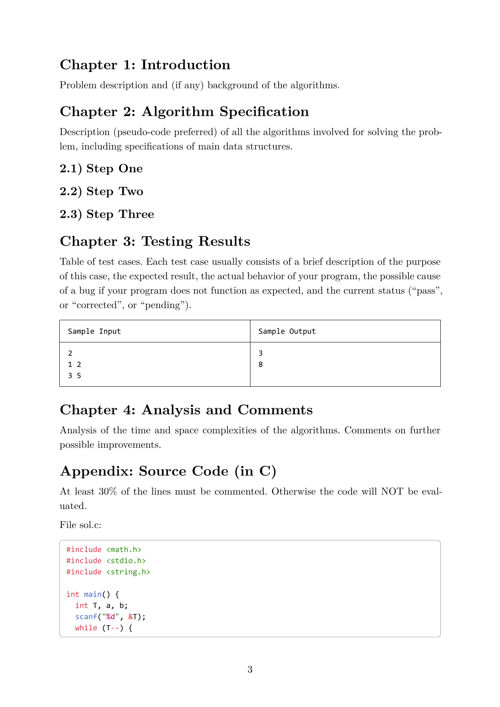
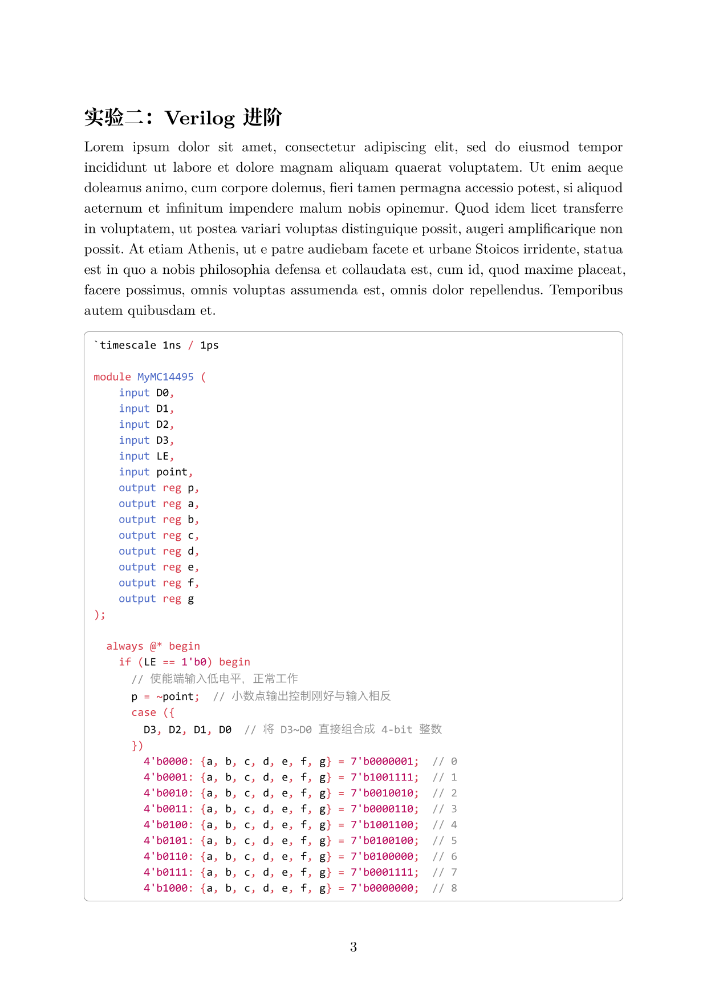

# ZJU-Project-Report-Template

Typst is a new text markup language, considered the successor of LaTeX. This is yet another Zhejiang University project report template written in Typst, mainly designed for the course "Fundamentals of Data Structures (211C0020)" and "Digital Logic Design (211C0060)".

**Reminder**: Due to requirements of some specific courses, disclosing personal information is prohibited and will be punished. So use this project at your own risk.

## Configuration

### Theme

Currently, I have provided two themes, corresponding to common lab reports and project reports in ZJU's Computer Science courses.

|          `theme: project`           |            `theme: lab`            |
| :---------------------------------: | :--------------------------------: |
|  |  |
|  |  |
|  |  |

### Fonts

I have configured default fallback options for serif, sans-serif, and monospace fonts, which you can set by modifying `font_serif`, `font_sans_serif`, and `font_mono` parameters.

However, for better rendering experiences, Chineses font families that support arbitrary levels of font weight, such as [Source Han Serif SC](https://github.com/adobe-fonts/source-han-serif/releases/tag/2.002R), is recommanded.

## Features

### Blocks

We provided a series of block functions to offer an experience that is similar to the callout feature in Obsidian. You can set the theme by modifying the `block_theme` parameter.

```typst
#note(name: [Lagrange Inversion Theorem])[
  Given a power serie $F(x)$ and another power series $G(x)$ related by $F(G(x))=G(F(x))=x$, then the nth coefficient of $F(x)$ is
  $ [x^n] F(x) = 1/n [x^(-1)] 1/(G^n (x)). $
]
```

Some alias we have provided is as follows: `example`, `proof`, `abstract`, `summary`, `info`, `note`, `tip`, `hint`, `success`, `important`, `help`, `warning`, `attention`, `caution`, `failure`, `danger`, `error`, `bug`, `quote`, `cite`, `experiment`, `question`, `analysis`.

